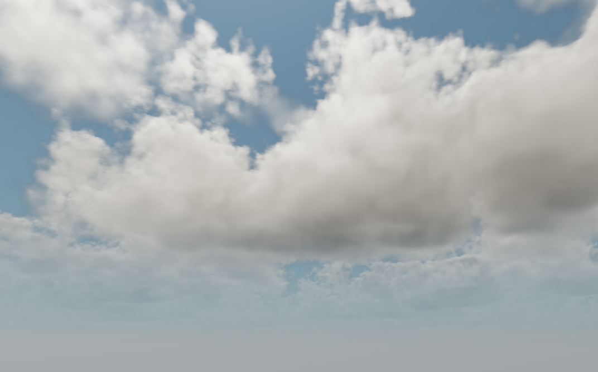
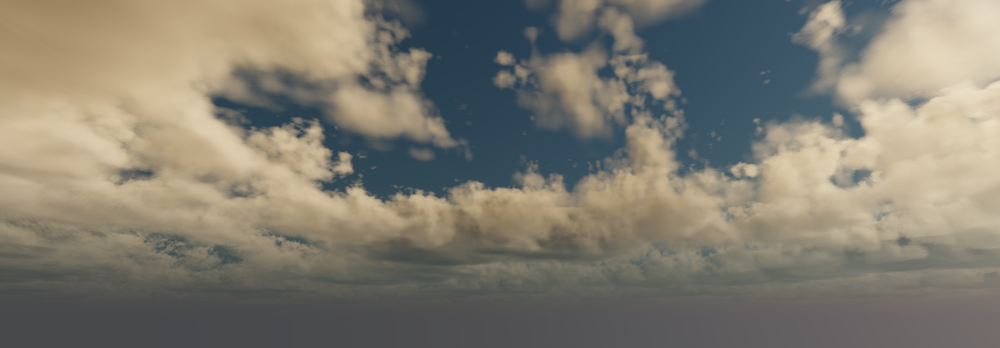
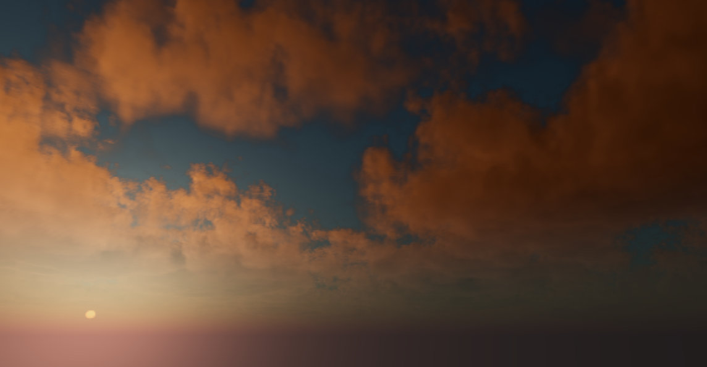

# Volumetric Clouds

This is a demo implementing one way of drawing volumetric
cloudscapes in Godot sky shaders.

This demo uses animated clouds generated from ray marching
3D textures. It features automatic time of day adjustments
just by rotating the sun.

Renderer: Vulkan

## Fork changes

- Added a simple script featuring automatic day night cycling.
- Added a basic character controller + simple level

## Screenshots

